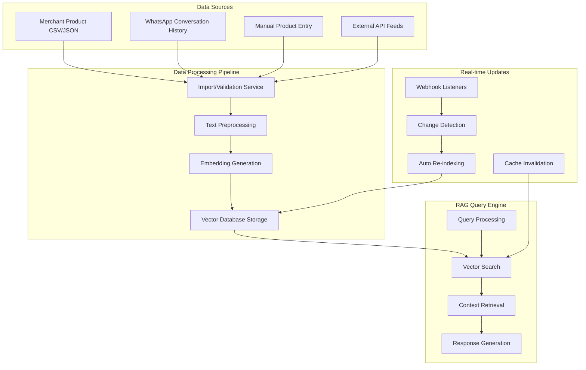

# YarnMarket AI RAG System Flow

## 🔄 Complete RAG System Architecture

### 1. Data Flow Overview



### 2. Data Provisioning Sources

#### A. Merchant Product Catalog Sources
- **CSV/Excel Uploads**: Bulk product imports via dashboard
- **JSON API Feeds**: Real-time product sync from merchant systems
- **Manual Entry**: Direct product entry through merchant portal
- **WhatsApp Conversations**: Product mentions and descriptions
- **External Integrations**: Shopify, WooCommerce, inventory systems

#### B. Real-time Data Sync
- **Webhook Integration**: Merchant inventory systems push updates
- **Scheduled Sync**: Periodic pulls from merchant APIs
- **Manual Refresh**: On-demand re-indexing through dashboard
- **Conversation Mining**: Extract product info from customer chats

### 3. Import/Export Mechanisms

#### Import Formats Supported:
```json
{
  "products": [
    {
      "id": "PROD_001",
      "name": "iPhone 14 Pro Max",
      "description": "Latest Apple smartphone with advanced camera",
      "price": 450000,
      "currency": "NGN",
      "category": "Electronics > Smartphones",
      "brand": "Apple",
      "in_stock": true,
      "quantity": 15,
      "specifications": {
        "storage": "256GB",
        "color": "Deep Purple",
        "condition": "Brand New"
      },
      "tags": ["iphone", "apple", "smartphone", "premium"],
      "images": ["https://example.com/iphone14.jpg"],
      "last_updated": "2024-01-15T10:30:00Z"
    }
  ]
}
```

#### Export Capabilities:
- **Full Catalog Export**: Complete product database dump
- **Filtered Exports**: By category, price range, availability
- **Analytics Export**: Performance metrics, search analytics
- **Embeddings Export**: Vector representations for backup

### 4. Embedding Generation Process

#### Text Processing Pipeline:
1. **Product Description Creation**:
   ```
   Product: iPhone 14 Pro Max
   Category: Electronics > Smartphones  
   Brand: Apple
   Price: ₦450,000
   Features: 256GB storage, Deep Purple color, Brand New condition
   Tags: premium smartphone, latest model, advanced camera
   ```

2. **Embedding Models Used**:
   - **Primary**: `all-MiniLM-L6-v2` (384 dimensions)
   - **Multilingual**: `paraphrase-multilingual-MiniLM-L12-v2`
   - **Nigerian Context**: Fine-tuned model for Pidgin/local terms

3. **Vector Storage Structure**:
   ```
   Collection: merchant_[merchant_id]_products
   Document ID: product_[product_id]
   Metadata: {
     merchant_id, product_id, category, price, 
     currency, in_stock, last_updated
   }
   Vector: [0.234, -0.456, 0.789, ...] (384D)
   ```

### 5. Real-time Update Triggers

#### Automatic Re-indexing Events:
- Product price changes
- Stock availability updates
- New product additions
- Product deletions
- Description modifications

#### Update Processing:
1. **Change Detection**: Compare incoming data with existing
2. **Incremental Updates**: Only re-embed changed products
3. **Batch Processing**: Group updates for efficiency
4. **Cache Invalidation**: Clear search caches
5. **Performance Monitoring**: Track re-indexing time

## 🛠️ Implementation Components

### 1. Backend Services Required

#### A. Product Import Service
```python
# services/product-import/main.py
class ProductImportService:
    async def import_from_csv(self, merchant_id: str, file_path: str):
        # Parse CSV, validate data, queue for processing
        
    async def import_from_api(self, merchant_id: str, api_config: dict):
        # Fetch from external API, normalize data
        
    async def process_product_batch(self, products: List[Product]):
        # Generate embeddings, store in vector DB
```

#### B. RAG Query Engine
```python
# services/rag-engine/main.py
class RAGQueryEngine:
    async def search_products(self, query: str, merchant_id: str):
        # Vector similarity search, retrieve top matches
        
    async def generate_response(self, query: str, context: List[Product]):
        # Use retrieved context to generate response
```

#### C. Real-time Sync Service  
```python
# services/sync-service/main.py
class SyncService:
    async def handle_webhook(self, merchant_id: str, payload: dict):
        # Process real-time updates from merchant systems
        
    async def schedule_sync(self, merchant_id: str):
        # Periodic sync with merchant inventory
```

### 2. Database Schema

#### PostgreSQL Tables:
```sql
-- Product catalog storage
CREATE TABLE merchant_products (
    id UUID PRIMARY KEY,
    merchant_id VARCHAR(255) NOT NULL,
    product_id VARCHAR(255) NOT NULL,
    name TEXT NOT NULL,
    description TEXT,
    price DECIMAL(10,2),
    currency VARCHAR(3),
    category VARCHAR(255),
    brand VARCHAR(255),
    in_stock BOOLEAN DEFAULT true,
    quantity INTEGER,
    specifications JSONB,
    tags TEXT[],
    images TEXT[],
    created_at TIMESTAMP DEFAULT NOW(),
    updated_at TIMESTAMP DEFAULT NOW(),
    UNIQUE(merchant_id, product_id)
);

-- Import/export jobs tracking
CREATE TABLE import_jobs (
    id UUID PRIMARY KEY,
    merchant_id VARCHAR(255) NOT NULL,
    job_type VARCHAR(50), -- 'csv_import', 'api_sync', etc.
    status VARCHAR(50), -- 'pending', 'processing', 'completed', 'failed'
    file_path TEXT,
    total_products INTEGER,
    processed_products INTEGER,
    failed_products INTEGER,
    error_details JSONB,
    created_at TIMESTAMP DEFAULT NOW(),
    completed_at TIMESTAMP
);

-- RAG performance metrics
CREATE TABLE rag_metrics (
    id UUID PRIMARY KEY,
    merchant_id VARCHAR(255) NOT NULL,
    collection_name VARCHAR(255),
    total_documents INTEGER,
    avg_query_time FLOAT,
    cache_hit_rate FLOAT,
    last_reindex TIMESTAMP,
    status VARCHAR(50),
    recorded_at TIMESTAMP DEFAULT NOW()
);
```

#### Vector Database (ChromaDB):
```python
# Collection per merchant
collection_name = f"merchant_{merchant_id}_products"

# Document structure
{
    "ids": ["prod_001", "prod_002"],
    "documents": ["iPhone 14 Pro Max - Apple smartphone...", "..."],
    "metadatas": [
        {
            "merchant_id": "merchant_123",
            "product_id": "PROD_001", 
            "category": "Electronics",
            "price": 450000,
            "currency": "NGN",
            "in_stock": true,
            "last_updated": "2024-01-15T10:30:00Z"
        }
    ],
    "embeddings": [[0.234, -0.456, ...], [...]]
}
```

### 3. API Endpoints for RAG Management

```python
# RAG management endpoints
@app.post("/api/merchants/{merchant_id}/products/import")
async def import_products(merchant_id: str, file: UploadFile):
    # Handle CSV/JSON product imports
    
@app.get("/api/merchants/{merchant_id}/products/export")
async def export_products(merchant_id: str, format: str = "json"):
    # Export merchant products
    
@app.post("/api/merchants/{merchant_id}/rag/reindex")
async def reindex_collection(merchant_id: str):
    # Trigger full re-indexing
    
@app.get("/api/merchants/{merchant_id}/rag/metrics")
async def get_rag_metrics(merchant_id: str):
    # Return RAG performance metrics
    
@app.post("/api/merchants/{merchant_id}/webhooks/products")
async def handle_product_webhook(merchant_id: str, payload: dict):
    # Real-time product updates
```

## 📊 Dashboard Integration

### 1. Import/Export Interface
- **Drag & Drop Upload**: CSV/JSON file uploads
- **Progress Tracking**: Real-time import status
- **Error Handling**: Failed imports with detailed errors
- **Export Options**: Various formats and filters

### 2. RAG Configuration Panel
- **Embedding Model Selection**: Choose optimal model per merchant
- **Similarity Thresholds**: Configure search sensitivity  
- **Cache Settings**: Control cache TTL and strategies
- **Reindexing Schedules**: Automated refresh intervals

### 3. Performance Monitoring
- **Real-time Metrics**: Query times, hit rates, document counts
- **Historical Analytics**: Performance trends over time
- **Alert Configuration**: Thresholds for performance degradation
- **Health Dashboards**: System status visualization

## 🔄 Real-time Data Flow Example

### Scenario: Merchant Updates iPhone Price

1. **Merchant Action**: Updates iPhone 14 price from ₦450,000 to ₦420,000
2. **Webhook Trigger**: Merchant's system sends webhook to YarnMarket
3. **Change Detection**: System detects price change
4. **Re-embedding**: Generate new embedding with updated price info
5. **Vector Update**: Replace old embedding in ChromaDB
6. **Cache Clear**: Invalidate related search caches
7. **Dashboard Update**: Real-time metrics update in admin panel
8. **Customer Impact**: Next customer query returns updated price

### API Call Flow:
```bash
# Webhook receives update
POST /api/merchants/tech_solutions/webhooks/products
{
  "product_id": "PROD_001",
  "name": "iPhone 14 Pro Max", 
  "price": 420000,
  "updated_at": "2024-01-15T14:30:00Z"
}

# System processes update
1. Validate webhook signature
2. Update PostgreSQL record
3. Generate new embedding
4. Update ChromaDB collection
5. Invalidate Redis cache
6. Send WebSocket update to dashboard
7. Log metrics
```

This comprehensive system ensures merchants have real-time, accurate product information available to their AI assistants while providing administrators complete control over the RAG system performance and data quality.
